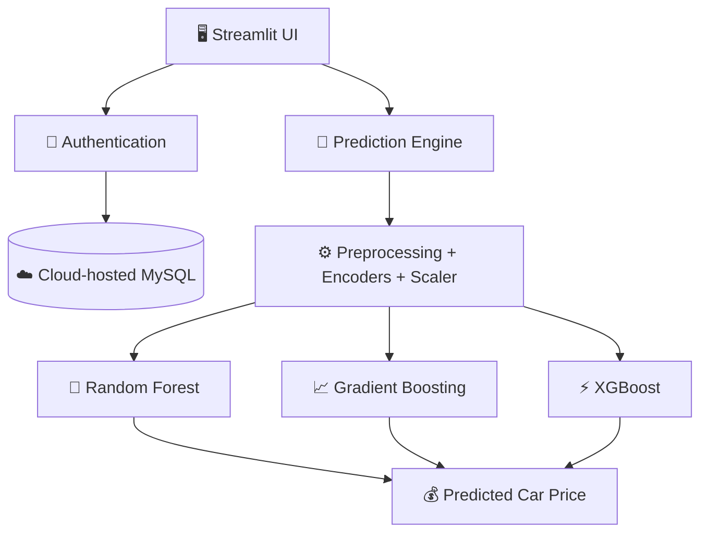

<div align="center">

# 🚗 Car Price Predictor

### From raw used-car data → tuned ML models → a deployed prediction platform

[](https://www.python.org/)
[](https://streamlit.io/)
[](https://xgboost.readthedocs.io/)
[](https://www.mysql.com/)
[](#-license)

**[🌐 Live Demo](https://car-price-predictor-find.streamlit.app/) · [📂 Source Code](https://github.com/Nancy-sharma01/car-price-prediction)**

</div>

---

## 📖 Overview

**Car Price Predictor** is an end-to-end machine learning web application that estimates the resale value of used cars using the **CarDekho dataset**. It's not a model sitting in a notebook — it's a full product: authenticated users pick a trained model, inspect how well it generalizes, and get an instant price estimate for their own car.

The project spans the complete ML lifecycle — **data cleaning → feature engineering → model tuning → overfitting analysis → deployment** — wrapped in a Streamlit interface backed by a cloud-hosted MySQL database.

```
🔐 Sign up / Log in
        ↓
🤖 Compare trained models (Test R², overfit gap, diagnostics)
        ↓
🚘 Enter car specifications
        ↓
💰 Get an instant, model-backed price estimate
```

---

## ✨ Features

| Category | What's included |
|---|---|
| 🧹 **Preprocessing** | Missing-value handling, duplicate removal, brand extraction from high-cardinality names, outlier clipping, label encoding, feature scaling |
| 🤖 **Modeling** | Random Forest, Gradient Boosting, and XGBoost regressors — tuned with `RandomizedSearchCV` |
| 📊 **Diagnostics** | Train/Test R², overfit gap, MAE, Actual-vs-Predicted plots, model-to-model comparison |
| 🔐 **Authentication** | MySQL-backed signup/login, bcrypt password hashing, session-based auth, logout |
| 🖥️ **Interface** | Multi-page Streamlit app — dashboard, model selection, live prediction, interactive visualizations |
| ☁️ **Deployment** | Live on Streamlit Community Cloud, connected to a cloud-hosted MySQL instance via Streamlit Secrets |

---

## 🧠 Model Performance

| Model | Train R² | Test R² | Overfit Gap | Test MAE (₹) |
|---|:---:|:---:|:---:|---:|
| Random Forest | 0.983 | 0.889 | 0.094 | 68,380 |
| Gradient Boosting | 0.964 | 0.912 | 0.052 | 63,911 |
| **XGBoost** ⭐ | 0.963 | **0.914** | **0.049** | **62,853** |

> **Selected model: XGBoost** — highest test R², lowest test MAE, and the smallest train/test gap of the three, making it the most reliable generalizer among the candidates.

---

## 🏗️ Architecture



---

## 🛠️ Tech Stack

<table>
<tr>
<td valign="top">

**Data & ML**
- Python, Pandas, NumPy
- Scikit-learn, XGBoost
- Joblib (model serialization)

</td>
<td valign="top">

**Visualization**
- Matplotlib
- Seaborn

</td>
<td valign="top">

**Application**
- Streamlit
- MySQL + `mysql-connector-python`
- bcrypt

</td>
<td valign="top">

**Tooling**
- Git & GitHub
- VS Code
- Streamlit Community Cloud

</td>
</tr>
</table>

---

## 📂 Project Structure

```
car-price-prediction/
│
├── app.py                    # Streamlit application
├── train.py                  # Preprocessing, training & tuning pipeline
├── auth.py                   # Signup / login logic
├── database.py                # MySQL connection layer
│
├── database/
│   └── car_price.sql          # Database schema
│
├── cardekho.csv                # Training dataset
├── requirements.txt
├── .gitignore
└── README.md
```

**Generated ML artifacts** (produced by `train.py`, consumed by `app.py`):
`all_models.pkl` · `best_model.pkl` · `best_model_name.pkl` · `model_metrics.pkl` · `scaler.pkl` · `label_encoders.pkl` · `feature_order.pkl`

---

## ⚙️ Run Locally

```bash
# 1. Clone the repository
git clone https://github.com/Nancy-sharma01/car-price-prediction.git
cd car-price-prediction

# 2. Create & activate a virtual environment
python -m venv .venv
.venv\Scripts\activate        # Windows

# 3. Install dependencies
pip install -r requirements.txt

# 4. Train the models (generates the .pkl artifacts)
python train.py

# 5. Add your database credentials to .streamlit/secrets.toml
#    ⚠️ never commit this file

# 6. Launch the app
streamlit run app.py
```

---

## ☁️ Deployment

The app is deployed on **Streamlit Community Cloud**, with a **cloud-hosted MySQL database** handling authentication:

- The repo is connected directly to Streamlit Cloud for **push-to-deploy** — every commit to `main` redeploys the app automatically.
- Database credentials (host, user, password, DB name) live in **Streamlit Secrets**, never in the codebase.
- `database.py` opens a MySQL connection to the cloud instance on demand, so the app stays stateless between reruns and scales the same way locally and in production.
- The trained model artifacts (`.pkl` files) ship inside the repo, so the deployed app loads them directly via `joblib` at startup — no separate model server needed.

---

## 📊 Dataset

Built on the **[CarDekho Used Car Dataset](https://www.kaggle.com/)** (Kaggle), containing real used-car listings with attributes like fuel type, transmission, mileage, engine size, and ownership history. Used strictly for educational and ML-experimentation purposes.

---

## 🔮 Future Improvements

- 📈 Per-user prediction history & personalized dashboards
- 🔐 Google OAuth authentication
- 🧠 SHAP-based model explanations
- 🚘 Similar-car recommendations
- 🤖 LightGBM / CatBoost as additional candidate models
- 📊 Deeper residual and error analysis

---

## 💡 Key Learnings

Building this project meant working across the **full ML product lifecycle**, not just modeling:

`Data cleaning` · `Feature engineering` · `Regression modeling` · `Hyperparameter tuning` · `Overfitting analysis` · `Model comparison` · `Model serialization` · `Streamlit UI development` · `MySQL integration` · `Authentication & password hashing` · `Cloud deployment` · `Secrets management`

---

## 👩‍💻 Author

**Nancy Sharma**
B.Tech CSE (AI/ML) — JMIT Radaur · Class of 2027
Interested in Data Science, AI/ML, and Software Development.

[](https://github.com/Nancy-sharma01)
📧 nancysharma11bh@gmail.com

---

<div align="center">

⭐ **If you found this project interesting, explore the repo and try the live app!**

</div>
